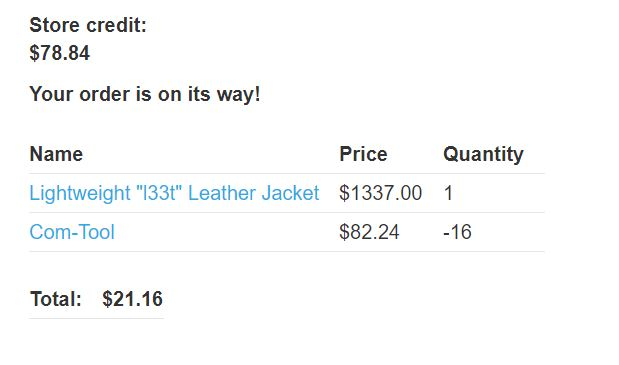

1. Click "View detail" butotn on the item "Lightweight "l33t" Leather Jacket".
2. In BurpSuite, turn on Interception. Go back to "Lightweight "l33t" Leather Jacket" item page and click the "Add to cart" button and see the intercepted request.
3. This request has a "quantity" parameter that specifies the quantity of the item you want to add to cart. Change this parameter to -1, which is a negative number.
4. Interestingly, now if you go to your cart, the quantity of this item is -1 and the total price is -$1337.00.
5. If you click the "Place order" button, you will receive the error "Cart total price cannot be less than zero". It seems that this website does have some kind of protection. 
6. Solving this problem is not hard. First, remove the current item from your cart. Then add some items to your cart with negative quantity until the negative cost plus the cost of the "Lightweight "l33t" Leather Jacket" gives you a cheap enough price (but greater than 0).
7. Just add one more "Lightweight "l33t" Leather Jacket" to your cart and the price will now be cheap enough for you to buy.

